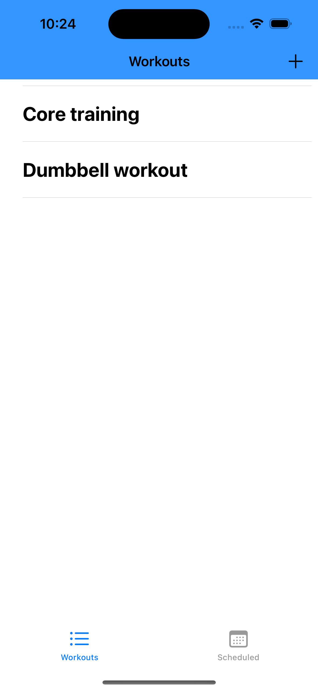
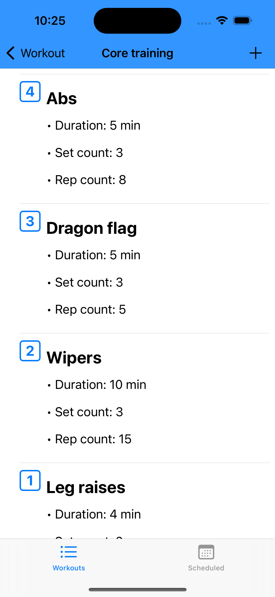
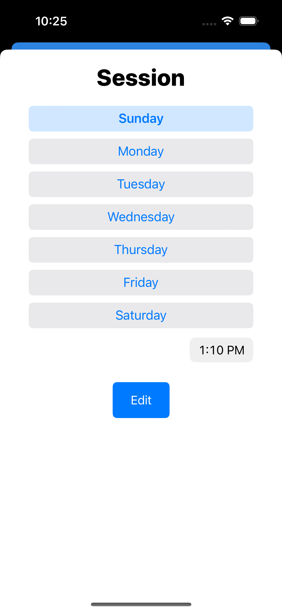
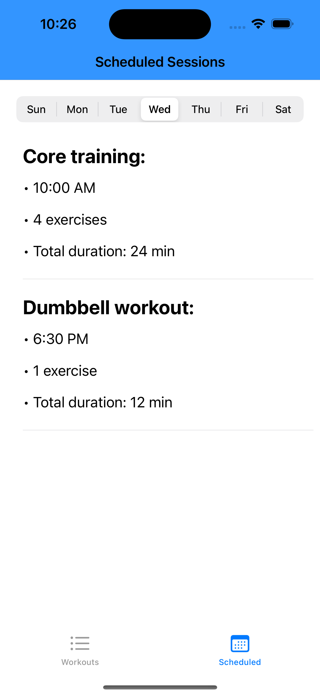

Some core screens:

<p align = "center">
 
 
</p>

## Table of contents
* [General info](#general-info)
* [Technologies](#technologies)
* [Design pattern chosen](#design-pattern-chosen)
* [Setup](#setup)
* [Improvements](#improvements)
* [Known issues](#known-issues)

## General info

This is a fitness application to schedule workout sessions, with the capabilities to:
- Create workouts
- Add any number of desired exercises to each one of those workouts
- Specify how you want to tackle those exercises (Set count, rep count and time)
- Arrange your desired ordering for all your exercises
- Schedule recurring days and time of the week to tackle on your workouts through sessions
- Browse through all your available sessions set for any given day of the week
	
## Technologies
Project is created with:
* VIPER design pattern
* Core Data framework
* SnapKit framework
* CocoaPods dependency manager

## Design pattern chosen
VIPER was chosen as an optimal way to modularize and encapsulate properly responsibilities for each screen, this allows for better decoupling and this as well makes it easier to debug and test features.
	
## Setup
To run this project, install the required frameworks using CocoaPods:

```
$ cd ../Workout
$ pod install
```

## Improvements
There is plenty to improve:

* I still need to handle error cases in the app
* Disable being able to add sessions if there are no exercises set for a workout
*  Add prompts to empty exercises and sessions view
* I would like to set times on exercises to be optional

And there are other tech additions I would love to try:
* Publish on the app store
* Local notifications if someone wants to be notified when a session is about to start
* Github Actions + Fastlane
* GraphQL for downloading premade workouts

## Known issues
The drag and drop behavior from the ExercisesTableView class it's not perfect as I just keep reloading the table view each time there is a move NSFetchedResultsChangeType. I wasn't able to find online any proper example for reordering items using CoreData (All the examples I tried behaved and updated the table view in weird ways).
