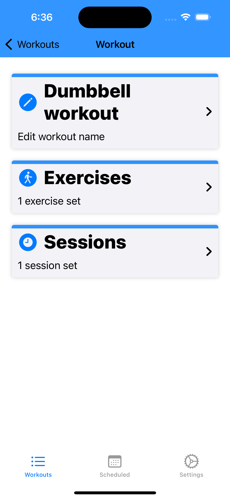
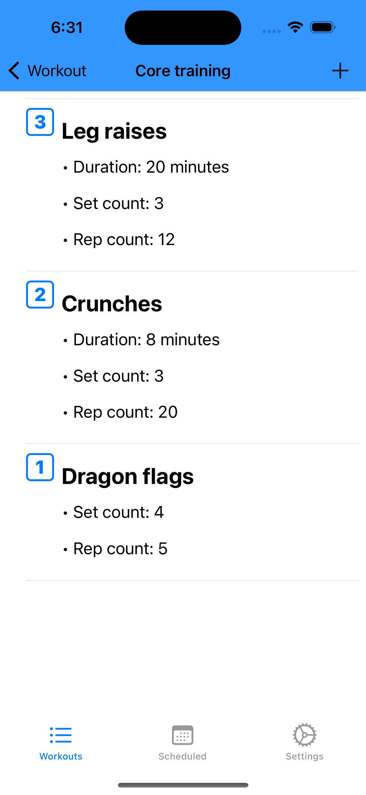
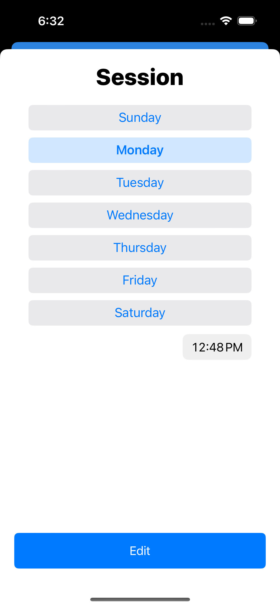
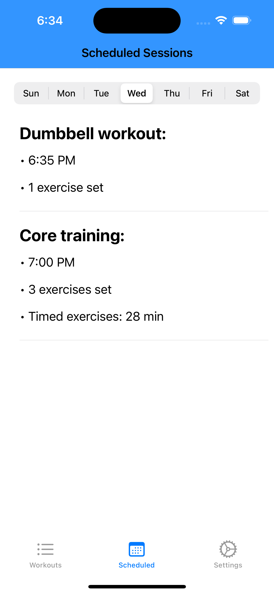

Some core screens:

<p align = "center">
 
 

</p>

## Table of contents
* [General info](#general-info)
* [Technologies](#technologies)
* [Design pattern chosen](#design-pattern-chosen)
* [Setup](#setup)
* [Improvements](#improvements)
* [Known issues](#known-issues)

## General info

This is a fitness application to schedule workout sessions, with the capabilities to:
- Create workouts
- Add any number of desired exercises to each one of those workouts
- Specify how you want to tackle those exercises (Set count, rep count and time)
- Arrange your desired ordering for all your exercises
- Schedule recurring days and time of the week to tackle on your workouts through sessions
- Browse through all your available sessions set for any given day of the week
- Enable local notifications for when workout sessions are going to start

It's a fun project that actually has a functional use for myself as I have some stretching routines, as well some home workouts as well and the application can help me be a little more organized.
	
## Technologies
Project is created with:
* VIPER design pattern
* Core Data framework
* UserNotifications framework
* SnapKit framework
* CocoaPods dependency manager
* WWDC 2023 UIContentUnavailableConfiguration
* WWDC 2021 UIButton.Configuration

## Design pattern chosen
VIPER was chosen as an optimal way to modularize and encapsulate properly responsibilities for each screen, this allows for better decoupling and this as well makes it easier to debug and test features.
	
## Setup
To run this project, install the required frameworks using CocoaPods:

```
$ cd ../Workout
$ pod install
```

## Improvements
There is some work to improve:
* Disable being able to add sessions if there are no exercises set for a workout

And there are other tech additions I would love to try:
* Publish on the app store
* Github Actions + Fastlane
* GraphQL for downloading premade workouts

## Known issues
The drag and drop behavior from the ExercisesTableView class it's not perfect as I just keep reloading the table view each time there is a move NSFetchedResultsChangeType. I wasn't able to find online any proper example for reordering items using CoreData (All the examples I tried behaved and updated the table view in weird ways).
